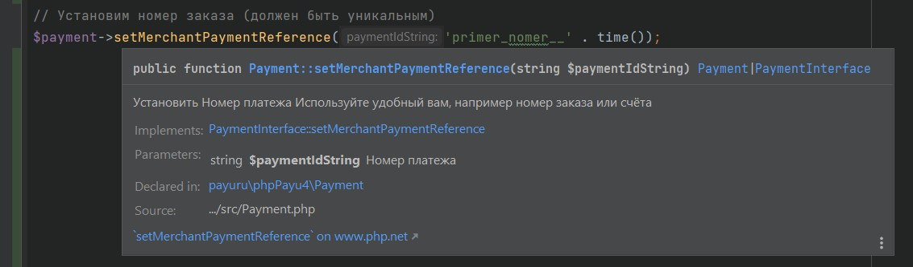

# PHP API Client для платёжной системы YourPayments
Примеры использования YourPayments API
 
YourPayments (Твои Платежи) - многофункциональная платёжная система, поддерживающая не только простые платежи с банковских карт, но и множество
форм оплаты, а также подписки и выплаты на карты.
 
Данный репозиторий написан по принципам SOLID, и каждый программный интерфейс снабжен подробной документацией на
русском языке.
 
Репозиторий также содержит примеры по принципу "одна строка кода - одна строка документации".

Репозиторий опубликован в виде [пакета Composer](https://packagist.org/packages/payuru/php-payu4) и может использоваться со всеми современными
фреймворками: Laravel, Symfony, Yii и другими.

Для работы рекомендуется использовать любую современную IDE (VS Code, Intellij Idea/PHPStorm,
Eclipse, Netbeans, etc), чтобы получать подробные подсказки прямо во время редактирования кода.



## Требования
Актуальные требования для использования пакета можно посмотреть 
в файле [composer.json](https://github.com/payuru/php-payu4/blob/main/composer.json)
в секции "require"

## Установка
### Composer
[Composer](https://getcomposer.org/) - это инструмент для управления зависимостями в PHP. Он позволяет вам объявить
библиотеки, от которых зависит ваш проект, и он будет управлять ими (устанавливать/обновлять) за вас.
```shell
composer require Ypmn
```

```php
// Для использования классов, например:
use Ypmn\Authorization;
use Ypmn\Delivery;
use Ypmn\IdentityDocument;
use Ypmn\Merchant;
use Ypmn\Payment;
use Ypmn\Client;
use Ypmn\Billing;
use Ypmn\ApiRequest;
use Ypmn\PaymentException;
use Ypmn\Product;
use Ypmn\Capture;
use Ypmn\Refund;
use Ypmn\Std;

// Подключите загрузчик классов от Composer
require vendor/autoload.php;
```

### PHP без фреймворков
Клонируйте или скачайте, а затем подключите файлы этого репозитория

## Примеры использования
### Начало работы
```php
// Создадим объект Мерчанта с помощью Идентификатора Мерчанта и Секретного Ключа Мерчанта
$merchant = new Merchant('rudevru1', 'hE9I1?3@|C8@w[1I&=y)');
```
### Создание (авторизация) платежа
Метод создаёт платёж (транзакцию) в системе Ypmn.
В зависимости от настройки, средства списываются либо сразу, 
либо после отправки метода "capture". 
####  Упрощённая интеграция, минимальный набор полей
```php
<?php
// Оплата по ссылке Ypmn
// Минимальный набор полей

// Представим, что мы не хотим передавать товары, только номер заказа и сумму
// Установим номер (ID) заказа (номер заказа в вашем магазине, должен быть уникален в вашей системе)
$merchantPaymentReference = "order_id_" . time();

$orderAsProduct = new Product([
    'name'  => 'Заказ №' . $merchantPaymentReference,
    'sku'  => $merchantPaymentReference,
    'unitPrice'  => 1.42,
    'quantity'  => 2,
]);

// Опишем Биллинговую (платёжную) информацию
$billing = new Billing;
// Установим Код страны
$billing->setCountryCode('RU');
// Установим Имя Плательщика
$billing->setFirstName('Иван');
// Установим Фамилия Плательщика
$billing->setLastName('Петров');
// Установим Email Плательщика
$billing->setEmail('test1@ypmn.ru');
// Установим Телефон Плательщика
$billing->setPhone('+7-800-555-35-35');
// Установим Город
$billing->setCity('Москва');

// Создадим клиентское подключение
$client = new Client;
// Установим биллинг
$client->setBilling($billing);

// Создадим платёж
$payment = new Payment;
// Установим позиции
$payment->addProduct($orderAsProduct);
// Установим валюту
$payment->setCurrency('RUB');
// Создадим и установим авторизацию по типу платежа
$payment->setAuthorization(new Authorization('CCVISAMC',true));
// Установим номер заказа (должен быть уникальным в вашей системе)
$payment->setMerchantPaymentReference($merchantPaymentReference);
// Установим адрес перенаправления пользователя после оплаты
$payment->setReturnUrl('http://127.0.0.1:8080/?function=returnPage');
// Установим клиентское подключение
$payment->setClient($client);

// Создадим HTTP-запрос к API
$apiRequest = new ApiRequest($merchant);
// Включить режим отладки (удалите в рабочей программе!)
$apiRequest->setDebugMode();
// Переключиться на тестовый сервер (удалите в рабочей программе!)
$apiRequest->setSandboxMode();
// Отправим запрос
$responseData = $apiRequest->sendAuthRequest($payment, $merchant);
// Преобразуем ответ из JSON в массив
try {
    $responseData = json_decode((string) $responseData["response"], true);

    // Нарисуем кнопку оплаты
    echo Std::drawYpmnButton([
        'url' => $responseData["paymentResult"]['url'],
        'sum' => $payment->sumProductsAmount(),
    ]);

    // .. или сделаем редирект на форму оплаты (опционально)
    // Std::redirect($responseData["paymentResult"]['url']);
} catch (Exception $exception) {
    //TODO: обработка исключения
    echo Std::alert([
        'text' => '
            Извините, платёжный метод временно недоступен.<br>
            Вы можете попробовать другой способ оплаты, либо свяжитесь с продавцом.<br>
            <br>
            <pre>' . $exception->getMessage() . '</pre>',
        'type' => 'danger',
    ]);
}
```
####  Расширенные возможности, полный набор полей
```php
<?php
// Оплата по ссылке Ypmn
// Представим, что нам надо оплатить пару позиций: Синий Мяч и Жёлтый Круг

// Опишем первую позицию
$product1 = new Product;
// Установим Наименование (название товара или услуги)
$product1->setName('Синий Мяч');
// Установим Артикул
$product1->setSku('ball-05');
// Установим Стоимость за единицу
$product1->setUnitPrice('500');
// Установим Количество
$product1->setQuantity(1);
// Установим НДС
$product1->setVat(20);

//Опишем вторую позицию с помощью сокращённого синтаксиса:
$product2 = new Product([
    'name'  => 'Жёлтый Круг',
    'sku'  => 'toy-15',
    'unitPrice'  => '1600',
    'quantity'  => '3',
    'vat'  => 0,
]);

// Опишем Биллинговую (платёжную) информацию
$billing = new Billing;
// Установим Код страны
$billing->setCountryCode('RU');
// Установим Город
$billing->setCity('Москва');
// Установим Регион
$billing->setState('Центральный регион');
// Установим Адрес Плательщика (первая строка)
$billing->setAddressLine1('Улица Старый Арбат, дом 10');
// Установим Адрес Плательщика (вторая строка)
$billing->setAddressLine1('Офис Ypmn');
// Установим Почтовый Индекс Плательщика
$billing->setZipCode('121000');
// Установим Имя Плательщика
$billing->setFirstName('Иван');
// Установим Фамилия Плательщика
$billing->setLastName('Петров');
// Установим Телефон Плательщика
$billing->setPhone('+79670660742');
// Установим Email Плательщика
$billing->setEmail('test1@ypmn.ru');

// (необязательно) Опишем Доствку и принимающее лицо
$delivery = new Delivery;
// Установим документ, подтверждающий право приёма доставки
$delivery->setIdentityDocument(
    new IdentityDocument('123456', 'PERSONALID')
);
// Установим Код страны
$delivery->setCountryCode('RU');
// Установим Город
$delivery->setCity('Москва');
// Установим Регион
$delivery->setState('Центральный регион');
// Установим Адрес Лица, принимающего заказ (первая строка)
$delivery->setAddressLine1('Улица Старый Арбат, дом 10');
// Установим Адрес Лица, принимающего заказ (вторая строка)
$delivery->setAddressLine1('Офис Ypmn');
// Установим Почтовый Индекс Лица, принимающего заказ
$delivery->setZipCode('121000');
// Установим Имя Лица, принимающего заказ
$delivery->setFirstName('Мария');
// Установим Фамилия Лица, принимающего заказ
$delivery->setLastName('Петрова');
// Установим Телефон Лица, принимающего заказ
$delivery->setPhone('+79670660743');
// Установим Email Лица, принимающего заказ
$delivery->setEmail('test2@ypmn.ru');
// Установим Название Компании, в которой можно оставить заказ
$delivery->setCompanyName('ООО "Вектор"');

// Создадим клиентское подключение
$client = new Client;
// Установим биллинг
$client->setBilling($billing);
// Установим доставку
$client->setDelivery($delivery);
// Установим IP (автоматически)
$client->setCurrentClientIp();
// И Установим время (автоматически)
$client->setCurrentClientTime();

// Создадим платёж
$payment = new Payment;
// Установим позиции
$payment->addProduct($product1);
$payment->addProduct($product2);
// Установим валюту
$payment->setCurrency('RUB');
// Создадим и установим авторизацию по типу платежа
$payment->setAuthorization(new Authorization('CCVISAMC',true));
// Установим номер заказа (должен быть уникальным в вашей системе)
$payment->setMerchantPaymentReference('primer_nomer__' . time());
// Установим адрес перенаправления пользователя после оплаты
$payment->setReturnUrl('http://127.0.0.1:8080/?function=returnPage');
// Установим клиентское подключение
$payment->setClient($client);

// Создадим HTTP-запрос к API
$apiRequest = new ApiRequest($merchant);
// Включить режим отладки (удалите в рабочей программе!)
$apiRequest->setDebugMode();
// Переключиться на тестовый сервер (удалите в рабочей программе!)
$apiRequest->setSandboxMode();
// Отправим запрос
$responseData = $apiRequest->sendAuthRequest($payment, $merchant);
// Преобразуем ответ из JSON в массив
try {
    $responseData = json_decode((string) $responseData["response"], true);

    // Нарисуем кнопку оплаты
    echo Std::drawYpmnButton([
        'url' => $responseData["paymentResult"]['url'],
        'sum' => $payment->sumProductsAmount(),
    ]);

    // .. или сделаем редирект на форму оплаты (опционально)
    // Std::redirect($responseData["paymentResult"]['url']);
} catch (Exception $exception) {
    //TODO: обработка исключения
    echo Std::alert([
        'text' => '
            Извините, платёжный метод временно недоступен.<br>
            Вы можете попробовать другой способ оплаты, либо свяжитесь с продавцом.<br>
            <br>
            <pre>' . $exception->getMessage() . '</pre>',
        'type' => 'danger',
    ]);
}
```
### Страница пользователя после совершения платежа
Данные о состоянии платежа после его создания передаются в параметрах POST ($_POST)
```php
print_r($_POST);
```
### Получить номер транзакции в YourPayments (GetStatus)
```php
<php
// Получить номер транзакции в Ypmn

// Номер заказа
$merchantPaymentReference = 'primer_nomer__184';
// Создадим HTTP-запрос к API
$apiRequest = new ApiRequest($merchant);
// Включить режим отладки (удалите в рабочей программе!)
$apiRequest->setDebugMode();
// Переключиться на тестовый сервер (удалите в рабочей программе!)
$apiRequest->setSandboxMode();
// Отправим запрос к API
$responseData = $apiRequest->sendStatusRequest($merchantPaymentReference);
```

### Списание средств (Capture)
В зависимости от настройки мерчанта, Ypmn может списывать денежные средства автоматически,
// Либо с помощью дополнительного запроса, описанного ниже.
```php
<php
// Запрос на списание денег

// Создадим такой запрос:
$capture = (new Capture);

// Номер платежа Ypmn (возвращается в ответ на запрос на авторизацию в JSON Response)
$capture->setPaymentReference(2297597);

// Cумма исходной операции на авторизацию
$capture->setOriginalAmount(5300);
// Cумма фактического списания
$capture->setAmount(3700);
// Валюта
$capture->setCurrency('RUB');

// Создадим HTTP-запрос к API
$apiRequest = new ApiRequest($merchant);
// Включить режим отладки (удалите в рабочей программе!)
$apiRequest->setDebugMode();
// Переключиться на тестовый сервер (удалите в рабочей программе!)
$apiRequest->setSandboxMode();
// Отправим запрос к API
$responseData = $apiRequest->sendCaptureRequest($capture, $merchant);
```
### Отмена платежа (Refund)
```php
<?php
// Инициировать возврат средств

// Создадим запрос
$refund = (new Refund);

// Установим номер платежа Ypmn - возвращается в ответ на запрос на авторизацию платежа в JSON Response
// См. пример с запросом Payment выше
$refund->setPaymentReference(2297597);
// Cумма исходной операции на списание (Capture)
// Пример: если сумма авторизации была 5300, а сумма списания 3700 (частичное списание), указать 3700 
$refund->setOriginalAmount(3700);
// Cумма фактического списания
$refund->setAmount(3700);
// Установим валюту
$refund->setCurrency('RUB');
// Создадим HTTP-запрос к API
$apiRequest = new ApiRequest($merchant);
// Включить режим отладки (удалите в рабочей программе!)
$apiRequest->setDebugMode();
// Переключиться на тестовый сервер (удалите в рабочей программе!)
$apiRequest->setSandboxMode();
// Отправим запрос к API
$responseData = $apiRequest->sendRefundRequest($refund, $merchant);
```

## Ссылки
- [Докуметация по API](https://dev.YPMN.ru/ru/documents/apiv4/)
- [Основной сайт Твои Платежи](https://YPMN.ru/)
- Начните знакомство с кодом с этих файлов: [example.php](https://github.com/payuru/php-payu4/blob/main/example.php) и
  класса [PaymentInterface.php](https://github.com/payuru/php-payu4/blob/main/src/PaymentInterface.php)
- [Задать вопрос или сообщить о проблеме](https://github.com/payuru/php-payu4/issues/new)

-------------

 
[YPMN.ru](https:/YPMN.ru/ "Платёжная система для сайтов и не только")
