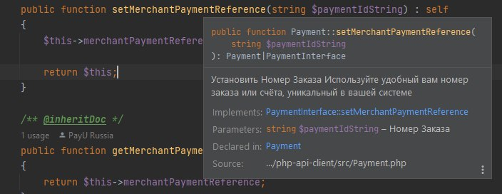

# PHP API Client для платёжной системы YourPayments
Клиентская библиотека для быстрой интеграции + примеры использования платёжной системы YourPayments.
 
YourPayments (Твои Платежи, YPMN) - многофункциональная платёжная система для сайтов, платформ и мобильных приложений,
поддерживающая не только простые платежи с банковских карт, но и множество форм оплаты,
а также подписки и выплаты на карты.
 
Эта библиотека снабжена подробной документацией на русском языке и предназначена для быстрой интеграции платёжной системы.

Репозиторий опубликован в виде [пакета Composer](https://packagist.org/packages/yourpayments/php-api-client) и может использоваться со всеми современными
фреймворками: Laravel, Symfony, Yii и другими.


## Требования
Актуальные требования для использования пакета можно посмотреть 
в файле [composer.json](https://github.com/yourpayments/php-api-client/blob/main/composer.json)
в секции "require"

## Установка
### Composer
[Composer](https://getcomposer.org/) - это инструмент для управления зависимостями в PHP. Он позволяет вам объявить
библиотеки, от которых зависит ваш проект, и он будет управлять ими (устанавливать/обновлять) за вас.
```shell
composer require yourpayments/php-api-client
```

```php
// Для использования классов, например:
use Ypmn\Authorization;
use Ypmn\Delivery;
use Ypmn\IdentityDocument;
use Ypmn\Merchant;
use Ypmn\Payment;
use Ypmn\Client;
use Ypmn\Billing;
use Ypmn\ApiRequest;
use Ypmn\PaymentException;
use Ypmn\Product;
use Ypmn\Capture;
use Ypmn\Refund;
use Ypmn\Std;

// Подключите загрузчик классов от Composer
require vendor/autoload.php;
```

### PHP без фреймворков
Клонируйте или скачайте, а затем подключите ([require](https://www.php.net/manual/ru/function.require.php)) файлы этого репозитория.

## Примеры использования
### Начало работы
```php
// Создадим объект Мерчанта с помощью Идентификатора Мерчанта и Секретного Ключа Мерчанта
$merchant = new Merchant('rudevru1', 'hE9I1?3@|C8@w[1I&=y)');
```
### Функции
1. [Cамый простой платёж](src/Documentation/simpleGetPaymentLink.md)
2. [Платёж со всеми полями](src/Documentation/getPaymentLink.md)
3. Получить токен (чтобы запомнить карту)
4. Оплата по токену
5. [Списание средств](src/Documentation/paymentCapture.md)
6. [src/Documentation/paymentRefund.md](src/Documentation/paymentRefund.md)
7. Проверка статуса платежа
8. [Страница после оплаты](src/Documentation/returnPage.md)

Для работы рекомендуется использовать любую современную IDE (VS Code, Intellij Idea/PHPStorm,
Eclipse, Netbeans, etc), чтобы получать подробные подсказки прямо во время редактирования кода.


## Ссылки
- [Докуметация по API](https://dev.YPMN.ru/ru/documents/apiv4/)
- [Основной сайт Твои Платежи](https://YPMN.ru/)
- Начните знакомство с кодом с этих файлов: [example.php](https://github.com/yourpayments/php-api-client/blob/main/example.php) и
  класса [PaymentInterface.php](https://github.com/yourpayments/php-api-client/blob/main/src/PaymentInterface.php)
- [Реквизиты тестовых банковских карт](https://dev.payu.ru/ru/documents/rest-api/testing/#menu-2)
- [Задать вопрос или сообщить о проблеме](https://github.com/yourpayments/php-api-client/issues/new)

-------------

 
[YPMN.ru](https://YPMN.ru/ "Платёжная система для сайтов и не только")
